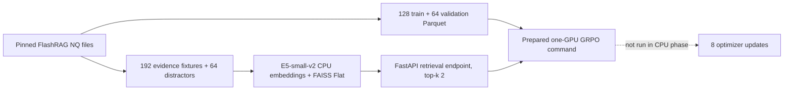

# Phase 1 small-scale implementation note

## Scope and stop condition

Phase 1 establishes a low-cost, inspectable path through Search-R1 before a GPU
is allocated. It covers deterministic QA data, a tiny fixture corpus, CPU dense
indexing, the retrieval HTTP contract, and unit tests for the RL-specific logic.
The stop condition is a verified CPU retriever. Model download, vLLM startup,
and GRPO training are explicitly outside this phase.



## Repository changes

- `scripts/data_process/phase1_smoke_nq.py` selects examples with fixed seeds,
  writes Search-R1-compatible nested Parquet rows, assigns stable question IDs,
  and records SHA-256 artifact hashes.
- `search_r1/search/index_builder.py` and `retrieval_server.py` accept
  `--device cpu|cuda`. Their default remains `cuda`, preserving upstream
  behavior; CPU+FP16 and CPU+FAISS-GPU combinations fail early.
- The retrieval endpoint rejects empty/blank query lists and non-positive
  `topk` values with a 4xx response.
- `train_grpo.sh` now uses its declared `DATA_DIR` for both Parquet files.
- `verl/trainer/ppo/ray_trainer.py` supports the optional
  `trainer.max_optimizer_steps` gate. When absent, legacy behavior is unchanged;
  when set, it counts actual actor updates and makes the optimizer schedule use
  that same horizon. This avoids the legacy global-step counter's start-at-one
  ambiguity.
- `.venv-phase1/` is ignored so CPU preparation packages never pollute source
  control or the eventual CUDA training environment.

## Fixture design

The fixture corpus contains exactly one answer-bearing document for every
selected QA row. Each document repeats the exact question and its accepted NQ
answers, which makes end-to-end plumbing failures obvious. Sixty-four unrelated
question/answer pairings provide deterministic distractors. IDs are split-aware
and deterministic (`evidence:<split>:<source-id>` and `distractor:<number>`).
Both source splits use seed 42 at pinned FlashRAG revision
`bcafb8dd07d453be3cbeeeb3f78be1841bddf92c`.

This creates intentional answer leakage. It is excellent for validating
retrieval, action loops, reward wiring, and masks; it is invalid for quality,
generalization, or benchmark claims. A later experiment must replace it with a
real corpus and an evaluation split whose evidence construction does not use
gold answers.

## CPU test contracts

The tests under `tests/phase1/` cover:

1. first-action parsing for `<search>` and `<answer>`, including malformed text;
2. final-answer extraction after the prompt's demonstration answer, normalized
   exact match, and reward values;
3. GRPO group-wise standardization for four trajectories per question and
   sequence-mask behavior;
4. information masking, asserting that only tokens injected between
   `<information>` boundaries are zero in the actor loss mask;
5. the FastAPI response shape, numeric scores, default top-k, and malformed
   request handling.

The live verifier adds an end-to-end assertion: the known query in the manifest
must return its answer-bearing evidence within top-2, every score must be finite,
and four malformed request forms must return 4xx.

## Prepared GPU experiment

The exact entry point is:

```bash
bash experiments/phase1_smoke/run.sh
```

Its effective configuration is:

| Item | Value |
|---|---:|
| model | `Qwen/Qwen2.5-0.5B-Instruct` |
| GPUs / tensor parallel | 1 / 1 |
| base questions / trajectories | 2 / 8 (`n_agent=4`) |
| PPO mini / micro batch | 8 / 1 |
| actor optimizer updates | 8 |
| turns / retrieval top-k | 2 / 2 |
| start / response / observation | 384 / 96 / 192 tokens |
| rolling prompt maximum | 1,152 tokens |
| rollout dtype / memory utilization | BF16 / 0.4 |
| gradient checkpointing | enabled |
| reference parameter offload | enabled |
| actor offload | disabled for params, gradients, optimizer |

The length ceiling is conservative: `384 + 2*96 + 2*192 = 960`, below the
1,152 rolling maximum. The command uses console logging and disables periodic
save/test operations for this smoke run.

## GPU prerequisites and remaining risks

Use the upstream-compatible Linux stack: Python 3.9, an NVIDIA GPU with BF16
support, CUDA 12.1-compatible driver/runtime, PyTorch 2.4.0, vLLM 0.6.3,
editable `verl`, FlashAttention 2, and the repository's remaining dependencies.
Keep the CPU retriever process in its isolated environment.

The GPU path remains unverified by design. Potential first-run blockers are GPU
memory pressure from colocated FSDP/vLLM workers, CUDA/FlashAttention binary
compatibility, model-download credentials or connectivity, and whether the
selected GPU supports BF16. Capture the console log and actual peak memory on
the first run before scaling any dimension.
